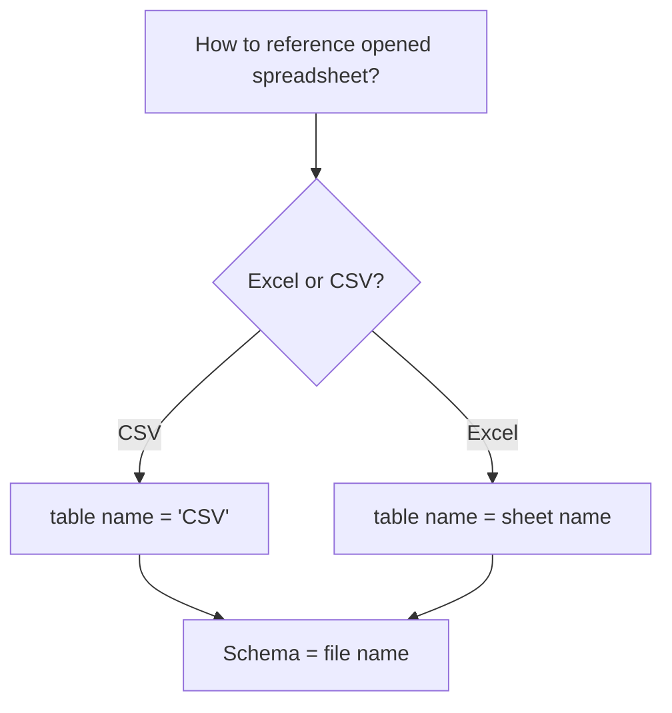

# Jesse's Sheety Driver (JSheetyDriver)
A JDBC driver for interacting with CSV files and Excel Spreadsheets.

This is still in bringup and not suitable for production use. Doc and testing forthcoming.

# Features

# Getting Started

# Schema and Table Geometry



# Special Commands

# Examples

Load the file `data.csv` and replace its contents with that of the DB2 table `jesseg.qcustcdt`
```sql
sheety cd C:/Users/me/Desktop/filejdbc;
sheety load data.csv;
sheety linkdb2as data.csv jesseg.qcustcdt;
commit;
```

Load the file `master.xlsx` and add/replace the sheet "Today's Netstat Info" with the contents of a Db2 query
to fetch the network statistics
```sql
sheety cd /my/directory;
sheety load netstat.xlsx;
sheety db2query netstat."Today's Netstat Info" SELECT * FROM QSYS2.NETSTAT_INFO;
commit;
```

Convert "Sheet1" of myfile.xlsx to a CSV file (myfile.csv).
```sql
sheety load_readonly myfile.xlsx;
sheety load myfile.csv;
create or replace table myfile.csv as (select * from myfile."Sheet 1");
commit;
```


Merge contents of data.csv into a new sheet in data.xlsx called "Today's data").
```sql
sheety load_readonly data.csv;
sheety load data.xlsx;
alter table data.csv rename to "Today's data";
commit;
```

Convert Myfile.csv into a new Excel document
```sql
sheety load_readonly myfile.csv;
sheety load myfile.xlsx;
commit;
```

