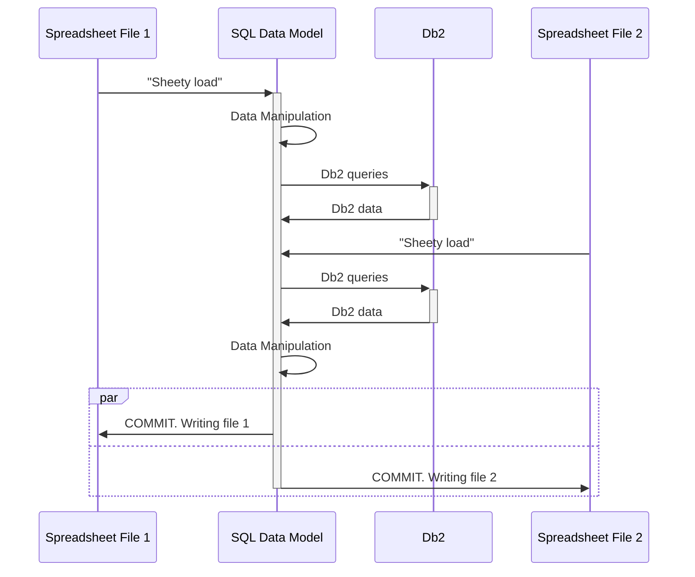
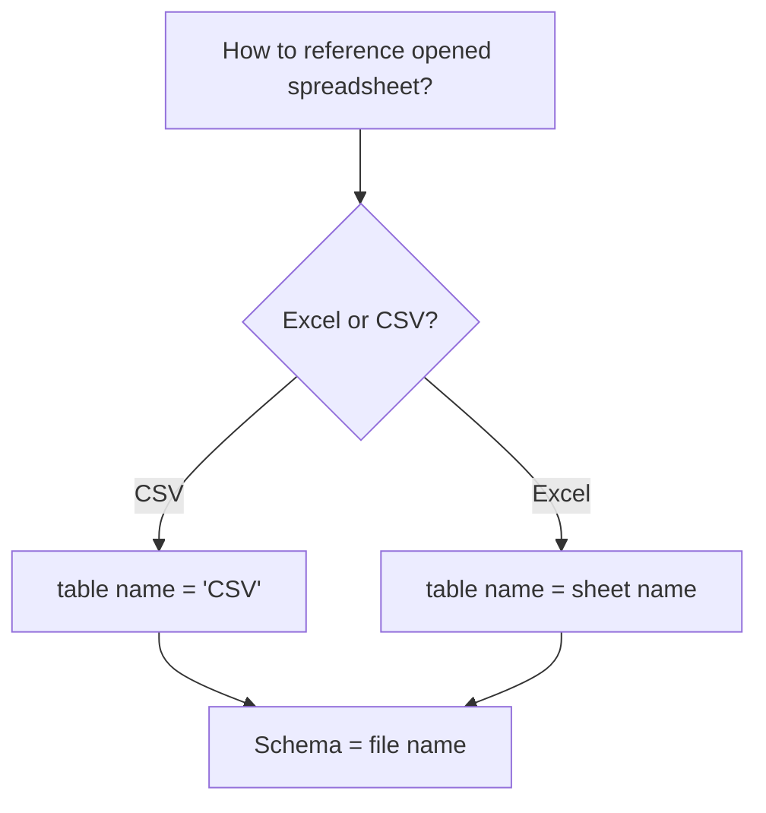

# Jesse's Sheety Driver (JSheetyDriver)

Want to write a sheety application? Well, you've come to the right place, because do I have a 
sheety driver for you! 

This project provides a JDBC driver for interacting with CSV files and Excel Spreadsheets. It also comes with special
integration for communicating with Db2 on IBM i. 

That's pretty sheety!!

Some of the features include:
- The ability to easily load/query/manipulate .csv files
- The ability to easily load/query/manipulate .xlsx (Excel) files

This is still in bringup and not suitable for production use. More doc and testing forthcoming.
Still, a highly sheety piece of software!

# Getting Started

## Connection String

There are three formats for the connection string:

**1. Simple**
```
sheety
```

**2. Specify a starting directory**
```
sheety:/my/directory/path
```

**3. Specify a file to load (this also sets the starting directory)**
```
sheety:/path/to/myfile.xlsx
```


## Connection Properties

The following connection properties are supported:
- `DB2SYSTEM` (optional): Specify an IBM i system to talk to
- `DB2UID` (optional): IBM i user id
- `DB2PW` (optional): Db2 password
- `TURBO` (optional): Specify "true" to run faster (default is false)

### Connection properties examples

Specifying a `Properties` object:

```java
final Properties p = new Properties();
p.put("DB2SYSTEM", "myibmi");
p.put("DB2UID", "myuser");
p.put("DB2PW", "mypw");
p.put("turbo", "true");
final Connection conn = DriverManager.getConnection("sheety", p);
```

Specifying on connection string

```java
final Connection conn = DriverManager.getConnection("sheety;DB2SYSTEM=myibmi;DB2UID=myuser;DB2PW=mypw;turbo=true");
```         

# Managing the data model (IMPORTANT)

In order to use this driver most effectively, it is important to understand how the driver works.

**When a file is loaded** 
The file is loaded into the SQL namespace per the documented schema and table geometry, below. If the file does
not exist, it may be created later.

**After a file is loaded**
SQL operations, such as INSERT, UPDATE, SELECT, can be performed on the tables in the SQL namespace. Advanced SQL is
allowed (conditions, joins, etc etc etc). You can create new tables (which can ultimately be written as a new
spreadsheet), delete tables, etc.

**When a commit happens**
The files are written to disk. The contents of the file are determined by the contents of data in the SQL namespace.



## Schema and Table Geometry




# Special Commands

Special commands for this driver can be executed by SQL statements that start with "sheety." 

Change the current working directory
```
sheety cd <dirname>
```

Loads the file from disk into the namespace (IMPORTANT NOTE: the file will also be rewritten to disk).
```
sheety load <filename>
```

Loads the file from disk into the namespace in read-only mode. The contents of the namespace can be modified, but
the rile contents will nto be written back to disk.
```
sheety load_readonly <filename>
```

Link the provided Db2 table into the SQL namespace. It will be mapped into the special `DB2` schema. 
```
sheety linkdb2 <db2_schema>.<db2_table>
```

Link the provided Db2 table into the SQL namespace. It will be mapped into the special `DB2` schema. 
```
sheety linkdb2as <namespace_schema>.<namespace_table> <db2_schema>.<db2_table>
```

Run the provided Db2Query and stores the results in the provided location:
```
sheety db2query <namespace_schema>.<namespace_table> <db2_query>
```

# Examples

Load the file `data.csv` and replace its contents with that of the DB2 table `jesseg.qcustcdt`
```sql
sheety cd C:/Users/me/Desktop/filejdbc;
sheety load data.csv;
sheety linkdb2as data.csv jesseg.qcustcdt;
commit;
```

Load the file `master.xlsx` and add/replace the sheet "Today's Netstat Info" with the contents of a Db2 query
to fetch the network statistics
```sql
sheety cd /my/directory;
sheety load netstat.xlsx;
sheety db2query netstat."Today's Netstat Info" SELECT * FROM QSYS2.NETSTAT_INFO;
commit;
```

Convert "Sheet1" of myfile.xlsx to a CSV file (myfile.csv).
```sql
sheety load_readonly myfile.xlsx;
sheety load myfile.csv;
create or replace table myfile.csv as (select * from myfile."Sheet 1");
commit;
```


Merge contents of data.csv into a new sheet in data.xlsx called "Today's data").
```sql
sheety load_readonly data.csv;
sheety load data.xlsx;
alter table data.csv rename to "Today's data";
commit;
```

Convert Myfile.csv into a new Excel document
```sql
sheety load_readonly myfile.csv;
sheety load myfile.xlsx;
commit;
```

# Known limitations

There are several known limitations when compared to other JDBC drivers, which include, but are not limited to:
- Changes are only persisted to file when a commit is explicitly requested (either through the `COMMIT` SQL 
directive or by invoking `close()` on the Connection object
- There is no transaction isolation, even across Statement objects. Thus, a `COMMIT` from one open Statement
may cause multiple files to be written, even if that work was done through different Statement objects. 
- File names are expected to be "simple." Compatibility with special symbols and spaces in filenames is untested
and therefore unknown.

# Can I link to other databases?

Yes!! Documentation forthcoming

# Performance considerations

Documentation forthcoming

# Using with Apache Camel

Documentation forthcoming
