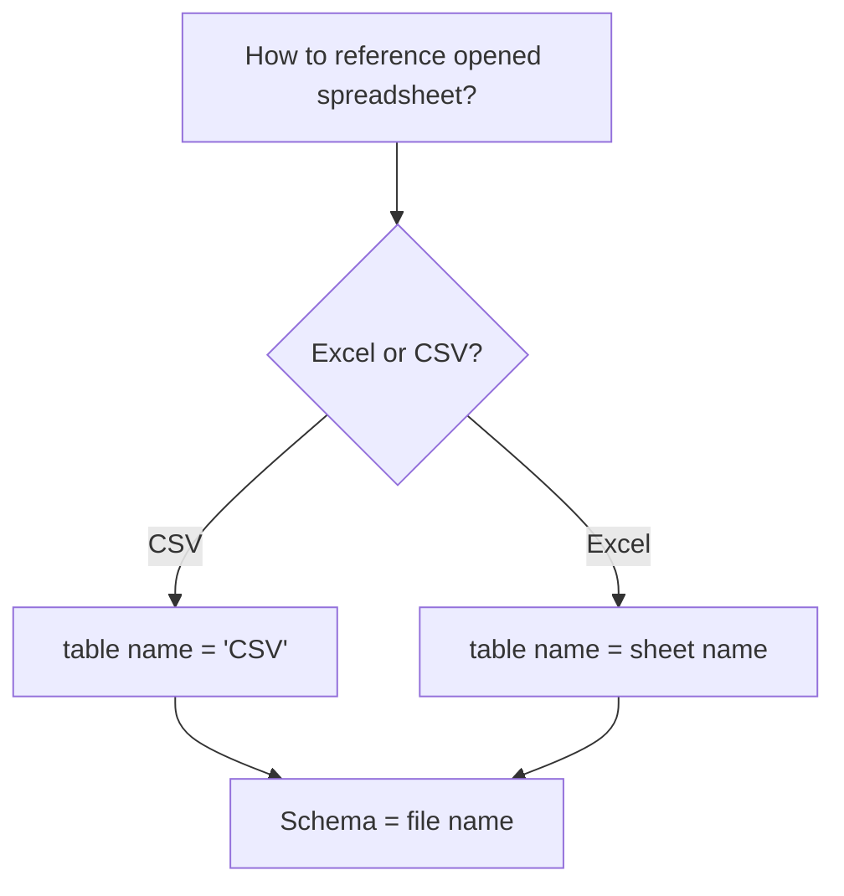

# Jesse's Sheety Driver (JSheetyDriver)
A JDBC driver for interacting with CSV files and Excel Spreadsheets.

This is still in bringup and not suitable for production use. Doc and testing forthcoming.

# Features

# Getting Started

# Schema and Table Geometry

# Special Commands
